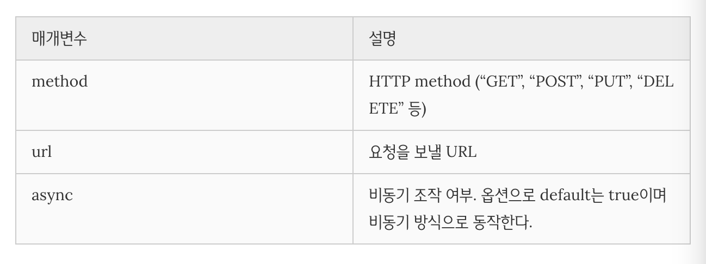
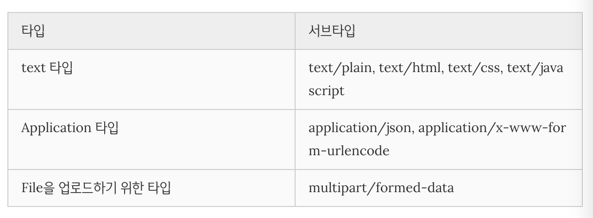

<h1>Day10</h1>

---
<h1>Chapter 1: 비동기식 처리모델과 Ajax</h1>

---
<h2>AJAX (Asynchronous JavaScript and XML)</h2>

- 메타데이터: 데이터를 수식하는 데이터
- 브라우저와 서버와의 통신
- 그 당시 브라우저는 AJAX가 돌기 어려워 구글이 V8을 개발했고 그걸 이용하여 처음 출시한것이 gmail과 google map이다
- 서버로부터 웹페이지가(HTML, CSS, JS) 반환되면 클라이언트 (브라우저)는 이를 렌더링하여 화면에 표시한다
- AJAX는 자바스크립트를 이용해서 비동기적 (Asynchronous)으로 서버와 브라우저가 데이터를 교환할 수 있는 통신 방식을 의미한다
- 서버로부터 웹페이지가 반환되면 화면 전체를 갱신해야 하는데 페이지 일부만을 갱신하고도 동일한 효과를 볼 수 있도록 하는것이 AJAX다
- 페이지 전체를 로드하여 렌더링할 필요가 없고 갱신이 필요한 일부만 로드하여 갱신하면 되므로 빠른 퍼포먼스와 부드러운 화면 표시 효과를 기대할수있다
- AJAX 요청에 의해 서버로부터 데이터를 응답받아 화면을 생성하는 경우, 브라우저의 주소창의 URL은 변경되지 않는다. 이는 사용자의 방문 history를 관리할 수 없는 것을 의미하며, SEO(Search Engine Optimization 검색엔진 최적화)이슈의 발생 원인이기도 하다
- history관리를 위해서는 각 페이지는 브라우저의 주소창에서 구별할 수 있는 유일한 URL을 소유하여야 한다

---
<h2>JSON (JavaScript Object Notation)</h2>

- JSON(JavaScript Object Notation)은 클라이언트와 서버 간 데이터 교환을 위해 규칙 즉 데이터 포맷을 말한다
- JSON은 일반 텍스트 포맷보다 효과적인 데이터 구조화가 가능하며 XML 포맷보다 가볍고 사용하기 간편하며 가독성도 좋다
- 자바스크립트의 객체 리터럴과 비슷하다. Hence the name, "Javascript Object Notation". 
- 하지만 JSON은 순수한 텍스트로 구성된 규칙이 있는 데이터 구조이다
- 키는 반드시 큰따옴표 (작은따옴표 사용불가)로 둘러싸야한다
- 서버쪽에서 html을 만들어서 보내는방법은 SEO면에서는 유리하다

<h3>JSON.stringify</h3>

- 객체를 JSON형식의 문자열로 변환한다
```js
var o = {
  name: 'Lee',
  gender: 'male',
  age: 20
};

// 객체 => JSON 형식의 문자열
var strObject = JSON.stringify(o);

console.log(typeof strObject, strObject);
// string {"name":"Lee","gender":"male","age":20}

// 객체 => JSON 형식의 문자열 + prettify (보기 편하게 만드는 편의기능)
var strPrettyObject = JSON.stringify(o, null, 2);
console.log(typeof strPrettyObject, strPrettyObject);
/*
string {
  "name": "Lee",
  "gender": "male",
  "age": 20
}
*/

// replacer
// 값의 타입이 Number이면 필터링되어 반환되지 않는다.
function filter(key, value) {
  return typeof value === 'number' ? undefined : value;
}

// 객체 => JSON 형식의 문자열 + replacer + prettify
var strFilteredObject = JSON.stringify(o, filter, 2);
console.log(typeof strFilteredObject, strFilteredObject);
/*
string {
  "name": "Lee",
  "gender": "male"
}
*/

```
- null값은 replacer 콜백함수를 넣은것이다 
- JSON은 기본적으로 배열을 가지고있을 확률이 높다
- 

<h3>JSON.parse</h3>

- JSON.parse 메소드는 JSON 데이터를 가진 문자열을 객체로 변환한다
- 역진렬화
```js
// JSON 형식의 문자열 => 객체
var obj = JSON.parse(strObject);
console.log(typeof obj, obj); // object { name: 'Lee', gender: 'male' }

// 문자열 => 배열 객체
var objArray = JSON.parse(strArray);
console.log(typeof objArray, objArray); // object [1, 5, "false"]
```

---
<h2>XMLHttpRequest</h2>

- 브라우저는 XMLHttpRequest 객체를 이용하여 AJAX요청을 생성하고 전송한다
- 서버가 브라우저의 요청에 대해 응답을 반환하면 같은 XMLHttpRequest 객체가 그 결과를 처리한다
- 생성자 함수

<h3>AJAX request</h3>

```js
// step 1 XMLHttpRequest 객체의 생성
var xhr = new XMLHttpRequest();
// step 2 비동기 방식으로 Request를 오픈한다. 통신채널을열고 준비한다
xhr.open('GET', '/users');//'/users'는 요청 url
// step 3 Request를 전송한다
xhr.send();
```
- 3번째 인자에 false를 주면 동기식

<h3>XMLHttpRequest.open</h3>

- XMLHttpRequest객체의 인스턴스를 생성하고 XMLHttpRequest.open 메소드를 사용하여 서버로의 요청을 준비한다
```js
XMLHttpRequest.open(method, url[, async])
```


<h3>XMLHttpRequest.send</h3>

- XMLHttpRequest.send메소드로 준비된 요청을 서버에 전달한다
- 기본적으로 서버로 전송하는 데이터는 GET, POST 메소드에 따라 그 전송방식에 차이가 있다
    1. **GET** 메소드의 경우, URL의 일부분인 쿼리문자열 (query string)로 데이터를 서버로 전송한다
    2. **POST** 메소드의 경우, 데이터 (페이로드)를 Request Body에 담아 전송한다
- XMLHttpRequest.send 메소드에는 request body에 담아 전송할 인수를 전달할 수 있다
- 만약 요청 메소드가 GET인 경우, send 메소드의 인수는 무시되고 request body는 null로 설정된다

<h3>XMLHttpRequest.setRequestHeader</h3> 

- XMLHttpRequest.setReqeuestHeader 메소드는 HTTP Request Header의 값을 설정한다
- setRequestHeader 메소드는 반드시 XMLHttpRequest.open 메소드 호출 이후에 호출한다
- Content-type
    - Content-type은 request body에 담아 전송할 데이터의 MIME-type의 정보를 표현한다
    - 자주 사용되는 MIME-type:

    
- Accept
    - HTTP 클라이언트가 서버에 요펑할 때 서버가 샌드백할 데이터의 MIME-type을 Accept로 지정 할 수 있다

    ```js
    // 서버가 센드백할 데이터의 MIME-type 지정: json
    
    req.setRequestHeader('Accept', 'application/json');
    ```
    - 만약 Accept헤더를 설정하지 않으면, send메소드가 호출될때 Accept헤더가 */*(어떤 포맷으로 받아도 괜찮다는 뜻)으로 전송된다 

<h3>Ajax response</h3>

- 

<h1>Qs</h1>

1. GET과 POST의 차이는?