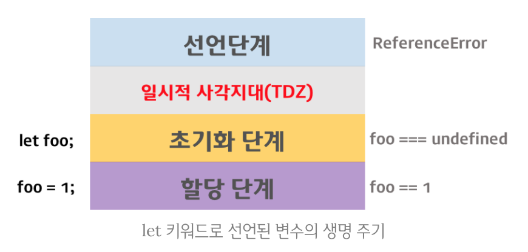

# Day 12 
# Chapter 1: ES6 let, const와 블록레벨 스코프

- ES5에서 변수를 선언할 수 있는 유일한 방법은 var키워드를 사용하는 것이었다
- var키워드로 선언된 변수는 다른 C-family 언어와는 차별되는 특징(설계상오류)으로 주의를 기울이지 않으면 심각한 문제를 발생시킨다
- var 키워드 특징:
    1. Function-level scope
        - 전역변수의 남발
        - for loop 초기화식에서 사용한 변수를 for loop 외부 또는 전역에서 참조할 수 있다
    2. var 키워드 생략 허용
        - 의도하지 않은 변수의 전역화
    3. 중복 선언 허용
        - 의도하지 않은 변수값 변경
    4. 변수 호이스팅
        - 변수를 선언하기 전에 참조가 가능하다

- 대부분의 문제는 전역 변수로 인해 발생한다
- 전역 변수는 유효범위(scope)가 넓어서 어디에서 어떻게 사용될 것인지 파악하기 힘들며 비순수 함수 (Impure function)에 의해 의도하지 않게 변경될 수도 있어서 복잡성을 증가시키는 요인이 된다
- 따라서 변수의 유효범위(scope)는 좁을수록 좋다
- let과 const키워드는 위의 var단점들을 보완해준다

## let
### Block-level scope
- 대부분의 C-family언어는 Block-level-scope를 지원하지만 Javascript는 Function-level-scope를 갖는다
- Function-level scope:  
    함수내에서 선언된 변수는 함수 내에서만 유효하며 함수 외부에서는 참조할 수 없다. 즉, 함수내부에서 선언한 변수는 지역변수이며 함수 외부에서 선언한 변수는 모두 전역변수이다
- Block-level scope:  
    코드 블럭 내에서 선언된 변수는 코드 블럭 내에서만 유효하며 코드블럭 외부에서는 참조할 수 없다
- ES6는 Block-level scope를 갖는 변수를 선언하기위해 let키워드를 제공한다 
- let 키워드로 선언된 변수는 Block-level scope를 갖는다

### 중복 선언 금지
- var는 중복 선언이 가능하였으나 let은 중복 선언시 syntaxError가 발생한다

### 호이스팅 (Hoisting)
- 자바스크립트는 ES6에서 도입된 let, const를 포함하여 모든 선언 (var, let, const, function, function*, class)을 호이스팅(hoisting)한다
- 호이스팅이란 var선언문이나 function 선언문등을 해당 스코프의 선두로 옮겨진것처럼 동작하는 특성을 말한다
- 하지만 var 키워드로 선언된 변수와는 달리 let 키워드로 선언된 변수를 선언문 이전에 참조하면 ReferenceError가 발생한다
- let키워드로 선언된 변수는 스코프의 시작에서 변수의 선언까지 **일시적 사각지대 (Temporal Dead Zone; TDZ)**에 빠지기 때문이다
- 호이스팅 3단계:
    1. 선언단계 (Declaration phase)
    2. 초기화 단계(Initialization phase)
    3. 할당 단계 (Assignment phase)
- var의 호이스팅은 변수 선언문 이전에 접근하여도 변수객체에 변수가 존재하기때문에 에러가 발생하지 않고 undefined가 반환된다
- let 키워드로 선언된 변수는 선언 단계와 초기화 단계가 분리되어 진행된다
- 스코프에 변수가 등록 (선언단계)되지만 초기화 단계는 변수 선언문에 도달했을 때 이루어진다
- 초기화 이전에 변수에 접근하려고 하면 ReferenceError 에러가 발생한다
- 이는 변수가 아직 초기화되지 않았기 때문인데 **스코프의 시작지점부터 초기화 시작 지점까지를 일시적 사각지대 (Temporal Dead Zone; TDZ)라고 부른다


### 클로저
- Block-level scope를 지원하는 let은 var보다 직관적이다
- Javascript의 Function-level scope로 인하여 for loop의 초기화식에 사용된 변수가 전역 스코프를 갖게되어 발생하는 문제를 회피하기 위해 클로저를 활용한 방법이다

### 전역 객체와 let
- 전역 객체는 모든 객체의 유일한 최상위 객체를 의미하며 일반적으로 Browser-side에서는 window 객체, Server-side(Node.js)에서는 global 객체를 의미한다
- var 키워드로 선언된 변수를 전역변수로 사용하면 전역 객체 (Global Object)의 프로퍼티가 된다
- let키워드로 선언된 변수를 전역변수로 사용하는 경우, let 전역변수는 전역객체의 프로퍼티가 아니다
- let 전역변수는 보이지않는 개념적인 블럭내에 존재하게 된다

---
## const

- const는 상수(변하지 않는 값)을 위해 사용한다
- 하지만 반드시 상수만을 위새 사용하지는 않는다

### 선언과 초기화
- let은 초기화 이후 다른 값으로 재할당이 자유로우나 const는 초기화 이후 재할당이 금지된다
- 주의할 것은 const는 반드시 선언과 동시에 초기화가 이루어져야 한다는 것이다
- 또한 const는 let과 마찬가지로 Block-level scope를 갖는다

### 상수
- 상수는 가독성의 향상과 유지보수의 편의를 위해 적극적으로 사용해야 한다
- const는 객체에도 사용될수 있다

### const와 객체
- const는 재할당이 금지된다
- 이는 변수의 값이 객체인경우, 객체에 대한 참조변경을 금지한다는것을 의미한다
- 하지만 객체의 프로퍼티는 보호되지않는다
- 재할당은 불가능하지만 할당된 객체의 내용(프로퍼티)은 변경할수있다
- 객체 타입 변수 선언에는 const를 사용하는 것이 좋다 
- WHY?
    - 일반적으로 객체에 대한 참조는 변경될 필요가 없다. 즉, const를 사용하여 객체 참조를 변경시킬 수 없어도 객체의 프로퍼티를 변경 가능하다. 만일 새로운 객체에 대한 참조를 변수에 재할당해야한다면 let을 사용한다
    - const를 사용한다 하더라도 객체의 프로퍼티를 변경할 수 있다
- 자바스크립트의 값은 대부분 객체(primitive형 변수를 제외한 모든 값은 객체이다)이므로 결국 대부분의 경우 const를 사용하게 된다

## var vs. let vs. const

- 아래와 같이 var, let, const사용하는 것을 추천한다
    - ES6를 사용한다면 var 키워드는 사용하지 않는다
    - 변경이 발생하지 않는(재할당이 필요없는) primitive형 변수와 객체형 변수에는 const를 사용한다
    - 재할당이 필요한 primitive형 변수에는 let을 사용한다

# Chapter 2: ES6 Template Literals
- ES6는 템플릿 리터럴(template Literals)라고 불리는 새로운 문자열 표기법을 도입하였다
- 템플릿 리터럴은 일반 문자열과 비슷해 보이지만, '또는 "같은 통상적인 따옴표 문자대신 백틱(backtick)문자 `를 사용한다
- 일반적인 문자열에서 줄바꿈은 허용되지 않으며 공백 (white-space)를 표현하기 위해서는 백슬래시(\)로 시작하는 이스케이프 시퀀스(Escape Sequence)를 사용하여야 한다
- ES6 탬플릿 리터럴은 일반적인 문자열과 달리 여러줄에 걸쳐 문자열을 작성할 수 있으며 탬플릿 리터럴 내의 모든 white-space는 있는 그대로 적용된다
- 템플릿 리터럴은 +연산자를 사용하지 않아도 간단한 방법으로 새로운 문자열을 삽입할 수 있는 기능을 제공한다
- 이를 String Interpolation(문자열 삽입)이라 한다
- $(expression)을 템플릿 대입문(template substitution)이라 한다
- 탬플릿 대입문에는 문자열뿐만아니라 JavaScript표현식을 사용할 수 있다

# Chapter 3: ES6 Arrow function 화살표 함수
## Arrow function의 선언 
- Arrow function(화살표 함수)은 function키워드 대신 화살표(=>)를 사용하여 간략한 방법으로 함수를 선언할 수 있다
```js
// 매개변수 지정 방법
    () => { ... } // 매개변수가 없을 경우
     x => { ... } // 매개변수가 한개인 경우, 소괄호를 생략할 수 있다.
(x, y) => { ... } // 매개변수가 여러개인 경우, 소괄호를 생략할 수 없다.

// 함수 몸체 지정 방법
x => { return x * x }  // single line block
x => x * x             // 함수 몸체가 한줄의 구문이라면 중괄호를 생략할 수 있으며 암묵적으로 return된다. 위 표현과 동일하다.

() => { return { a: 1 }; }
() => ({ a: 1 })  // 위 표현과 동일하다. 객체 반환시 소괄호를 사용한다.

() => {           // multi line block.
  const x = 10;
  return x * x;
};
```

## Arrow function의 호출
- Arrow function은 익명 함수로만 사용할 수 있다. 
- 따라서 Arrow function을 호출하기 위해서는 함수표현식을 사용한다
```js
// ES5
var pow = function (x) { return x * x; };
console.log(pow(10)); // 100

// ES6
const pow = x => x * x;
console.log(pow(10)); // 100
```
- 또는 콜백함수로 사용할 수 있다
- 이 경우 일반적인 함수표현식보다 표현이 간결하다
```js
// ES5
var arr = [1, 2, 3];
var pow = arr.map(function (x) { // x는 요소값
  return x * x;
});

console.log(pow); // [ 1, 4, 9 ]

// ES6
const arr = [1, 2, 3];
const pow = arr.map(x => x * x);

console.log(pow); // [ 1, 4, 9 ]
```

## this
### 일반함수의 this
- 일반 함수의 경우, 해당 함수 호출 패턴에 따라 this에 바인딩되는 객체가 달라진다. 콜백함수 내부의 this는 전역객체 window를 가리킨다
- 생성자 함수와 객체의 메소드를 제외한 모든 함수 (내부함수, 콜백함수 포함)의 내부의 this는 전역객체를 가리키기 때문이다
- 콜백함수 내부의 this가 메소드를 호출한 객체(생성자 함수의 인스턴스)를 가리키게 하기위해서는 아래의 3가지 방법이 있다:
    1. that = this  
    2. map (func, this)
    3. bind (this)

```js
// Solution 1: that = this

function Prefixer(prefix) {
  this.prefix = prefix;
}

Prefixer.prototype.prefixArray = function (arr) {
  var that = this;  // this: Prefixer 생성자 함수의 인스턴스
  return arr.map(function (x) {
    return that.prefix + ' ' + x;
  });
};

var pre = new Prefixer('Hi');
console.log(pre.prefixArray(['Lee', 'Kim']));
```

```js
// Solution 2: map(func, this)
function Prefixer(prefix) {
  this.prefix = prefix;
}

Prefixer.prototype.prefixArray = function (arr) {
  return arr.map(function (x) {
    return this.prefix + ' ' + x;
  }, this); // this: Prefixer 생성자 함수의 인스턴스
};

var pre = new Prefixer('Hi');
console.log(pre.prefixArray(['Lee', 'Kim']));
```
```js
// Solution 3: bind(this)
function Prefixer(prefix) {
  this.prefix = prefix;
}

Prefixer.prototype.prefixArray = function (arr) {
  return arr.map(function (x) {
    return this.prefix + ' ' + x;;
  }.bind(this)); // this: Prefixer 생성자 함수의 인스턴스
};

var pre = new Prefixer('Hi');
console.log(pre.prefixArray(['Lee', 'Kim']));
```

### Arrow function의 this
- 