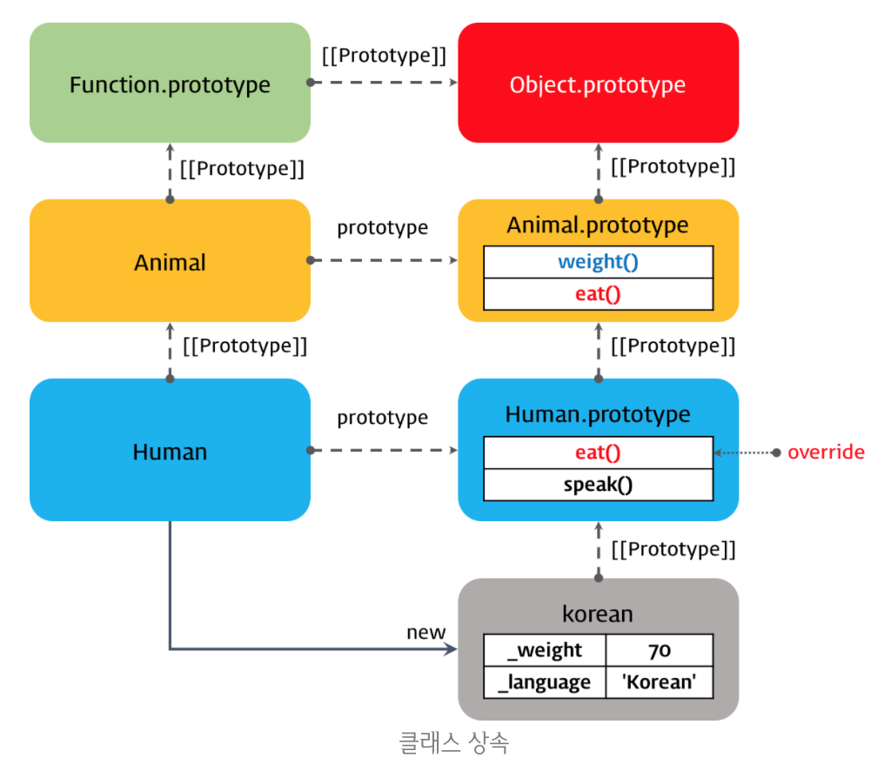

# Day 14
# Chapter 1: Class continued...

## 인스턴스 생성
- 클래스의 인스턴스를 생성하려면 new 연산자와 함께 생성자를 호출한다
- new 연산자를 사용하지 않고 생성자를 호출하면 에러가 발생한다
## Constructor
- constructor는 인스턴스를 생성하고 초기화하기 위한 특수한 메소드이다
- constructor는 클래스 내에 한개만 존재할수 있으며 만약 클래스가 2개 이상의 constructor메소드를 포함하면 SyntaxError가 발생한다
- 생성자 함수를 가리킨다
- Prototype내에 constructor라는 프로퍼티가 있고 constructor가 생성자함수를 가리킨다
- 인스턴스를 생성할때 new 연산자와 함께 호출한 것이 바로 constructor이며 constructor의 파라미터에 전달한 값은 멤버변수에 할당한다
- constructor를 생략하면 클래스에 constructor(){}를 포함한 것과 동일하게 동작한다.
- 따라서 빈객체가 생성되기 때문에 인스턴스의 생성과 동시에 멤버변수의 생성 및 초기화를 실행할 수 없다
```js
class Bar {
  // constructor는 인스턴스의 생성과 동시에 멤버 변수의 생성 및 초기화를 실행할 수 있다.
  constructor(num) {
    this.num = num;
  }
}

console.log(new Bar(1)); // Bar { num: 1 }
```
## 멤버 변수
- 클래스 바디에는 메소드만을 포함할 수 있다
- 클래스 바디에 멤버 변수를 선언하면 SyntaxError가 발생한다
- 따라서 멤버변수의 선언과 초기화는 반드시 constructor내부에서 실시한다
- construc내부에서 선언한 멤버 변수 name은 this(클래스의 인스턴스)에 바인딩되어 있으므로 언제나 public이다. 즉, 외부에서 참조 가능하다
- ES6 class는 private, public, protected 키워드와 같은 접근 제한자 (Access modifier)를 지원하지 않는다

## 호이스팅(Hoisting)
- class 선언문 이전에 class를 참조하면 ReferenceError가 발생한다
- 일시적 사각지대 (TDZ)에 빠지기때문에 
- Class도 사실은 함수이다. 하지만 function키워드로 선언한 함수와 같은 방식으로 호이스팅하지않고 let, const키워드로 선언한 함수표현식과 같이 호이스팅한다

## getter, setter
### getter
- getter는 어떤 멤버 변수에 접근할 때마나다 멤버 변수의 값을 조작하는 행위가 필요할때 사용한다
- 반드시 return문이 있어야 한다
- 프로퍼티처럼 사용하는 것이다

### setter
- setter는 어떤 멤버 변수에 값을 할당할 때마다 멤버변수의 값을 조작하는 행위가 필요할 때 사용한다

## 정적 메소드(Static method)
- static 키워드는 클래스의 정적 (static)메소드를 정의한다
- 정적 메소드는 클래스의 인스턴스화(instantiating)없이 클래스 이름으로 호출하며 클래스의 인스턴스로 호출할 수 없다
- 정적 메소드는 Math객체의 메소드와 같이 애플리케이션 전역에서 사용할 유틸리티(utility)함수를 생성하는데 주로 사용된다
- 함수 객체는 prototype 프로퍼티를 갖는데 일반 객체의 [[Prototype]] 프로퍼티와는 다른 것이며 일반 객체는 prototype프로퍼티를 가지지 않는다
- 정적 메소드인 staticMethod는 함수객체 Foo의 member, 프로토타입 메소드인 prototypeMethod는 Foo.prototype의 멤버가 되므로 staticMethod는 foo에서 호출할수 없게 된다

## 클래스 상속 (Class Inheritance)
- 상속(또는 확장)은 코드 재사용의 관점에서 매우 유용하다
- 새롭게 정의할 클래스가 기존에 있는 클래스와 매우 유사하다면, 동일한 구현은 상속을 통해 그대로 사용하고 다른점만 구현하면 된다
- 코드 재사용은 개발비용을 현저히 줄일 수 있는 잠재력이 있기 때문에 매우 중요하다

### extends 키워드
- extends키워드는 부모 클래스(Base class)를 상속하는 자식 클래스(Sub class)의 생성을 위해 클래스 선언에 사용된다
- super= 상속받는 객체의 constructor와 reference를 가리킨다
- 오버로딩(Overloading): 매개변수의 타입 또는 객수가 다른, 같은 이름의 메소드를 구현하고 매개변수에 의해 메소드를 구별하여 호출하는 방식이다. 자바스크립트는 오버로딩을 지원하지않지만 arguments객체를 사용하여 구현할 수는 있다
- 오버라이딩(Overriding): 상위 클래스가 가지고 있는 메소드를 하위클래스가 재정의하여 사용하는 방식이다
- 프로토타입 체인: 특정 객체ㅢ 프로퍼티나 메소드에 접근하려고 할 때 해당 객체에 접근하려는 프로퍼티 또는 메소드가 없다면 [[Prototype]]프로퍼티가 가리키는 링크를 따라 자신의 부모역할을 하는 프로토타입 객체의 프로퍼티나 메소드를 차레대로 검색한다


### super 키워드
- super 키워드는 부모 클래스의 프로퍼티를 참조(Reference)할 때 또는 부모 클래스의 constructor를 호출할 때 사용한다

---
# Chapter 2: Promise 프로미스
## Promise란?
- 

## 콜백 패턴의 단점
### 콜백 헬(Callback Hell)

### 에러처리의 한계

## Promise의 상태(State)

## Promise의 생성
- 

## Promise 후속 처리 함수 then, catch

---

# Chapter 3: Module 모듈
## Introduction
- 애플리케이션을 구성하는 개별적 요소로서 구현된 세부사항을 캡슐화하고 공개가 필요한 API를 외부에 노출하여 다른 코드에서 로드하여 사용할 수 있도록 작성된 재사용 가능한 코드 조각을 말한다
- 서버사이드의 Node.js는 사실상 모듈 시스템의 사실상 표준인 CommonJS를 채택하였고 현재는 독자적인 진화를 거쳐 CommonJS사양과 100% 동일하지는 않지만 기본적으로 CommonJS 방식을 따르고있다
- 이와 같은 상황에서 ES6에서는 Client-side Javascript에서도 동작하는 모듈기능을 추가하였다
- ES6 모듈을 현재의 브라우저에서 사용하기 위해서는 SystemJS, RequireJS등의 모듈 로더 또는 Webpack등의 모듈번들러를 사용하여야 한다

## export & import
- 모듈은 독립적인 파일 스코프를 갖기 때문에 모듈 안에 선언한 모든 것들은 기본적으로 해당 모듈 내부에서만 참조 가능하다. 만약 모듈 안에 선언한 항목을 외부에 공개하여 다른 모듈들이 사용할 수 있게 하고 싶다면 export해야 한다. 선언된 변수, 함수, 클래스 모두 export할 수 있다.
- 선언문 앞에 export 키워드를 사용한다. 여러개를 export할 수 있는데 이때 각각의 export는 이름으로 구별할 수 있다.
- 선언문 앞에 매번 export 키워드를 붙이는 것이 싫다면 export 대상을 모아 객체로 구성하여 한번에 export할 수도 있다.
```js
// lib.js
const pi = Math.PI;

function square(x) {
  return x * x;
}

class Person {
  constructor(name) {
    this.name = name;
  }
}

export { pi, square, Person };
```
- 각각의 이름을 지정하지 않고 하나의 이름으로 한꺼번에 import할 수도 있다. 이때 import되는 항목은 as 뒤에 지정한 객체의 프로퍼티가 된다
```js
// main.js
import { pi, square, Person } from './lib';

console.log(pi);         // 3.141592653589793
console.log(square(10)); // 100
console.log(new Person('Lee')); // Person { name: 'Lee' }
```
```js
// main.js
import * as lib from './lib';

console.log(lib.pi);         // 3.141592653589793
console.log(lib.square(10)); // 100
console.log(new lib.Person('Lee')); // Person { name: 'Lee' }
```
- 이름을 변경하여 import할 수도 있다.
```js
/ main.js
import { pi as PI, square as sq, Person as P } from './lib';

console.log(PI);    // 3.141592653589793
console.log(sq(2)); // 4
console.log(new P('Kim')); // Person { name: 'Kim' }
```
- 모듈에서 하나만을 export하는 경우, default 키워드를 사용할 수 있다. default를 사용하는 경우, var, let, const는 사용할 수 없다.
```js
// lib.js
function (x) {
  return x * x;
}

export default;

// lib.js
export default function (x) {
  return x * x;
}
```
- default 키워드와 함께 export한 모듈은 {} 없이 임의의 이름으로 import한다.
```js
// main.js
import square from './lib';

console.log(square(3)); // 9
```
---
# Chapter 4: Babel + Webpack [Babel 6와 Webpack 4를 이용한 ES6 환경 구축]
- 현재 브라우저는 ES6를 완전하게 지원하지 않는다
- Babel은 트랜스파일러로서 ES6를 ES5 이하의 버전으로 트랜스파일링한다 
- save-dev라는건 개발에서만 필요한거라는것
  - devDependencies