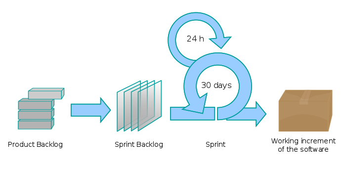

# Software Engineearing
# Software Release Life Cycle

- 초기 개발단계부터 마지막 출시까지 주기를 나타냄

# Testing and Development Period
## Pre-alpha
- 테스트 이전까지 진행되는 요구사항 분석, 설계, 개발, 유닛 테스트를 포함
- 핵심 기능이 동작하기 시작한 상태
## Alpha
- 소프트웨어 테스트를 시작하는 첫 단계
- 회사 내부 테스터를 통해 진행하며, 피드백을 통해 소프트웨어를 개선함
- 내부 인력 

---
### Beta
- 외부에 직,간접으로 오픈하여 테스트를 진행
	- 오픈 베타: 일반 유저에 모두 오픈하여 기능을 제공함.
    - 마케팅에 도움
    - 디테일한 버그를 잡아낼수 있다
    - 서버가 얼마정도의 용량을 버틸수 있나 테스트
	- 클로즈드 베타: 신청자 중 일부에 접근권한을 부여하고, 테스트를 진행함.

### RC(Release Candidate)
- 정식 제품이 될 가능성이 있는 베타버전. 심각한 문제가 없다면 이들 중 하나가 정식 버전이 됨.

---
## Release period
### RTM(Release to Manufacturing)
- 소프트웨어를 유저에게 제공될 준비가 완료된 상태
### GA(General Availability)
- 소프트웨어를 유저가 이용 가능한 상태

### 둘 차이
- 공장에 갖다주는버전 찍을 준비된 RTM
- 비닐푸장된후 팔 준비가 된 GA

---
## Agile Process

---
## Scrum
- an iterative and incremental agile software development framework for managing product development

---
## Scrum
- The **product owner** represents the stakeholders and is the voice of the customer, who is accountable for ensuring that the team delivers value to the business.
- The **development team** is responsible for delivering potentially shippable increments (PSIs) of product at the end of each sprint (the sprint goal).
- facilitated by a **scrum master**, who is accountable for removing impediments to the ability of the team to deliver the product goals and deliverables.

---
## Sprint


--- 
## Planning Poker

- 애자일 추정을 위해 사용하는 도구
- 모든 팀원이 한가지 과제에 대해 충분히 토론하고 작업시간을 추정하기 위함
- deck 구성
0, 1/2, 1, 2, 3, 5, 8, 13, 20, 40, 100, ?, 무한대, 커피

- 점수는 단위 작업시간(8시간)을 의미함

---
## Planning Poker

- 플레이방법
	1. 추정할 과제를 가장 잘 아는 사람이 해당 과제에 대해 설명합니다.
	2. 다른 사람은 추정에 필요한 정보를 얻기위해 질문과 토의를 합니다.
	3. 각자 생각하는 이 과제의 점수를 보이지 않게 내려놓습니다.
	4. 점수를 공유하고 가장 낮은 점수, 가장 높은 점수를 낸 팀원이 이 점수를 낸 이유에 대해 설명합니다.
	5. 모든 팀원이 같은 점수를 낼 때 까지 3~4의 반복

---
## 일정 추정 과제
1. 은행 예금 계좌 및 체크카드 발급절차
2. Fizzbuzz
3. Profile Porfolio Page

ex)
회차 최소 최대 중간값
 1 1 10 5
 2 4 8 6
 3 5 5 5
 

---
## Pair Programming

---
## Pair Programming

- 시니어와 주니어가 한 팀을 이뤄 노하우를 전수하거나 같은 과제에 대해 충분한 논의를 함으로써 생산성 향상을 도모
- Navigator와 Driver가 한 팀을 이뤄 실시
- Navigator는 해당 과제에 대해 주도적으로 의견을 제시하고 Driver는 Navigator가 지시하는 대로 작업하되, 이해되지 않는 부분이 있다면 이의를 제기
- 약속한 시간이 지나면 Navigator와 Driver의 역할 변경
- 과제를 해결할 때 까지 반복

---
##  Pair Programming

### So, Let's Try!!


---
## Code Review

검토사항
- 요구사항
- 설계요구 충족여부
- 과도한코딩
- 같은 기능
- 함수의 입출력
- 빌딩블록(API, 라이브러리, 자료구조, ..)
- 변수 사용전 초기화


---
## Websocket
- 실시간 피드백 구현

---
### Request & Response
- 요청 응답 구현

---
### Communication channels
- simplex
- half-duplex
- full-duplex

---
### simplex
단방향통신
> 데이터를 전송하는 방향이 정해져있는 방식

---
### half-duplex
반이중통신
> 전송의 방향은 양방향이나 전송 순간에는 한쪽에서만 전송가능한 방식

---
### full-duplex
양방향통신
> 동시에 송수신이 가능한 방식

---
## Websocket
> 웹사이트가 사용자와 상호작용하기 위해 만들어진 기술
ws://

W3C가 API를 관리
port:80, HTTP1.1

---
## Before Websocket
- HTTP Request, Response
- Hidden Frame
- Long Polling

---
## Polling vs Websocket


---
## Differences between Socket, Websocket
Socket - HTTP run over TCP/IP (운영체제가 제어하면)
Websocket - run from web browser (브라우저가 제어하면)

---
### webSocket
HTML5의 표준 full-duplex 통신 방식
https://html.spec.whatwg.org/multipage/web-sockets.html#network

---
### socket.io

`npm install --save socket.io`

- 실시간 통신기술의 웹 브라우저 호환성 문제 해결을 위한 프로젝트
- IE6 부터 최신 브라우저까지 지원
- WebSocket, Flash Socket, AJAX Long Polling, AJAX Multipart Streaming, Forever iframe, JSONP Polling 기술 모두 포함
- 브라우저에 따라 최적화된 기술 사용
- 일관성있는 문법과 API로 개발 가능

https://caniuse.com/#search=web%20sockets

---
### chat.ejs
```html
<style>
	* { margin: 0; padding: 0; box-sizing: border-box; }
	body { font: 13px Helvetica, Arial; }
	form { background: #000; padding: 3px; position: fixed; bottom: 0; width: 100%; }
	form input { border: 0; padding: 10px; width: 90%; margin-right: .5%; }
	form button { width: 9%; background: rgb(130, 224, 255); border: none; padding: 10px; }
	#messages { list-style-type: none; margin: 0; padding: 0; }
	#messages li { padding: 5px 10px; }
	#messages li:nth-child(odd) { background: #eee; }
</style>

<ul id="messages"></ul>
<form action="">
	<input id="m" autocomplete="off" /><button>Send</button>
</form>
```

---
### connection

```js
var http = require("http").Server(app);
var io = require("socket.io")(http);

io.on("connection", function(socket){
	console.log("a user connected");
});

http.listen(8080, function(){
	console.log("Chat Server is running at localhost:8080");
});
```

```html
<script src="/socket.io/socket.io.js"></script>
<script>
	var socket = io();
</script>
```

---
### disconnect

```js
socket.on("disconnect", function(){
	console.log("user disconnected");
});
```

---
### emit message

```js
socket.on("chat message", function(msg){
	console.log("message: " + msg);
```

```html
<script src="http://code.jquery.com/jquery-1.11.1.js"></script>

var socket = io();
$("form").submit(function(){
	socket.emit("chat message", $("#m").val());
	$("#m").val("");
	return false;
});
```
---
### broadcast
- unicast : 1:1. 출발지와 목적지가 정해진 전송
- broadcast : 네트워크에 접속된 모든 기기에 정보를 전송
- multicast : 네트워크에 접속된 기기 중 선택하여 전송

---
### broadcast

```js
io.emit("chat message", msg);
```

```js
socket.on("chat message", function(msg){
	$("#messages").append($("<li>").text(msg));
});
```

---
## Let's rebuild websocket with co-worker!