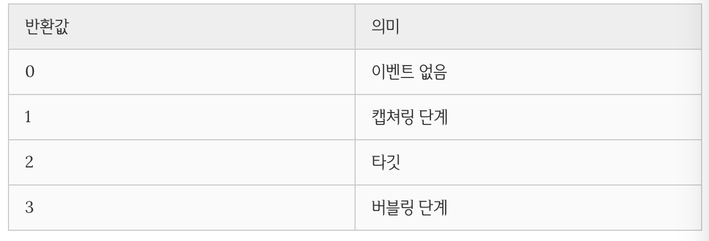

<h1>Day 8</h1>

---
<h1>Chapter 1: DOM 문서 객체 모델 (Document Object Model)</h1>

- "문서"란 HTML과 그 안에 포함된 css까지
- Model - 데이터 관련

<h2>DOM (Document Object Model)</h2>

- 웹문서를 브라우저가 이해할수 있는 구조로 메모리에 올린다 
- 브라우저의 렌더링 엔진은 웹 문서를 로드한 후, 파싱하여 웹 문서를 브라우저가 이해할 수 있는 구조로 구성하여 메모리에 적재하는데 이를 DOM이라 한다
- 웹 문서의 동적 변경을 위해 DOM은 프로그래밍 언어가 자신에 접근하고 수정할 수 있는 방법을 제공하는데 일반적으로 프로퍼티와 메소드를 갖는 JavaScript 객체로 제공된다
- 이를 DOM API(Application Programming Interface)라고 부른다
- 정적인 웹페이지에 접근하여 동적으로 웹페이지를 변경하기 위한 유일한 방법은 메모리 상에 존재하는 DOM을 변경하는 것이고, 이때 필요한 것이 DOM에 접근하고 변경하는 프로퍼티와 메소드의 집합인 API다
- DOM은 W3C의 공식표준인데 HTML과 Javascript과는 별개다
- DOM은 다음 두가지 기능을 담당한다
    1. HTML 문서에 대한 모델 구성
    2. HTML 문서 내의 각 요소에 접근/수정
---
<h2>DOM Tree</h2>

- DOM에서 모든 요소, 어트리뷰트, 텍스트는 하나의 객체이며 Document 객체의 자식이다
- DOM tree의 진입점(Entry point)는 document 객체이며 최종점은 요소의 텍스트를 나타내는 객체이다
- DOM tree는 네 종류의 노드로 구성한다
    1. 문서 노드(Document Node)
    2. 요소 노드(Element Node)
    3. 어트리뷰트 노드(Attribute Node)
    4. 텍스트 노드(Text Node)
- 요소노드와 어트리뷰트노드는 형제관계고
- 요소노드는 단 하나의 자식노드를 가지고있는데 텍스트노드다
- DOM을 통해 웹페이지를 조작(manipulate)하기 위해서는 다음과 같은 수순이 필요하다
    1. 조작하고자하는 요소를 선택 또는 탐색한다
    2. 선택된 요소의 콘텐츠 또는 어트리뷰트를 조작한다

---
<h2>DOM Query/Traversing(요소에 접근)</h2>

<h3>하나의 요소 노드 선택 (DOM Query)</h3>

- document.getElementById(id)
- document.querySelector(cssSelector)

<h3>여러개의 요소 노드 선택(DOM Query)</h3>

- document.getelementsByClass(class)
    - live라는 의미? 변화에 민감하고 변화가 감지되면 선택된 클래스에 더이상 선택되지않는 요소는 HTMl컬렉션에서 제외 그래서 loop를 돌렸을떄 의도된대로 작동되기 어렵다
    - 거꾸로 반복문 돌리는 방법도있다
    - HTML Collection을 배열로 변경하는 방법이 있다
- document.getElementsByTagName(tagName)
- document.querySelectorAll(selector)
    - 유사배열 
    - Return: NodeList (non-live)

<h3>DOM Traversing(탐색)</h3>

- parentNode (메서드아닌 프로퍼티)
- firstChild, lastChild (메서드아닌 프로퍼티)
    - jQuery:.prev(), jQuery.next()
- hasChildNodes() (메서드)
    - Boolean 값 return
- childNodes
    - non-live
- previousSibling, nextSibling

---

<h2>DOM Manipulation(조작)</h2>

<h3>텍스트 노드에의 접근/수정</h3>

- 요소의 텍스트는 텍스트노드에 저장되어있다
- 텍스트 노드에 접근하려면 아래와 같은 수순이 필요하다
    1. 해당 텍스트 노드의 부모 노드를 선택한다. 텍스트 노드는 요소 노드의 자식이다
    2. firstChild 프로퍼티를 사용하여 텍스트 노드를 탐색한다
    3. 텍스트 노드의 유일한 프로퍼티(nodeValue)를 이용하여 텍스트를 취득한다
    4. nodeValue를 이용하여 텍스트를 수정한다
- nodeValue
    - 노드의 값을 반환한다
    - Return: 텍스트 노드의 경우는 문자열, 요소노드의 경우 null반환

<h3>어트리뷰트 노드에의 접근/수정</h3>

- className
    - class 어트리뷰트의 값을 취득 또는 변경
- id
    - id 어트리뷰트의 값을 취득 또는 변경한다
- hasAttribute(attribute)
    - 지정한 어트리뷰트를 가지고있는지 검사
    - Return Boolean
- getAttribute(attribute)
    - 어트리뷰트의 값을 취득한다
    - Regurn 문자열
- setAttribute(attribute, value)
    - 어트리뷰트와 어트리뷰트 값을 설정한다
    - Return undefined
- removeAttribute(attribute)
    - 지정한 어트리뷰트를 제거한다
    - Return undefined

<h3>HTML 콘텐츠 조작(Manipulation)</h3>

- HTML 콘텐츠를 조작하기위해 아래의 프로퍼티 또는 메소드를 사용할수있다
- 마크업이 포함되 컨텐츠를 추가하는 행위는 크로스 스크립팅 공격 (XSS)에 취약하므로 주의가 필요하다
- textContent
- innerText
    - CSS에 순종적
    - 화며에 표시가 안되는 상태면 텍스트를 반환하지않는다
- InnerHTML
    - 해당 요소의 모든 자식 요소를 포함하는 모든 콘텐츠를 하나의 문자열로 취득할 수 있다 
    - 이 문자열은 마크업을 포함한다

<h3>DOM 조작 방식</h3>

- createElement(tagName)
- createTextNode(text)
- appendChild(Node)
- removeChild(Node)

<h3>insertAdjacentHTML()</h3>

- insertAdjacentHTML(position, string)
- 

<h3>innerHTML vs. DOM 조작방식 vs. insertAdjacentHTML()</h3>

- 

---

<h2>Style</h2>

- css에서는 케밥케이스를 사용하기때문에 DOM API에서는 카멜케이스로 변환하여 사용하는것을 허용한다
- window.getComputedStyle
- .getPropertyValue(prop)와 체인으로 사용하면 더 디테일한 값을 볼수있다

---

<h1>Chapter 2: Javascript Asynchronous processing Model</h1>
<h1>동기식 처리 모델 vs 비동기식 처리 모델</h1>

- 동기식 처리 모델 (synchronous processing model) 은 직렬적으로 작업을 수행한다. 즉 작업은 순차적으로 실행되며 어떤 작업이 수행 중이면 다음 작업은 대기하게 된다
- 비동기식 처리 모델 (Asynchronous processing model or Non-Blocking processing)은 병렬적으로 작업을 수행한다. 즉 작업이 종료되지 않은 상태라도 대기하지 않고 다음 작업을 실행한다는 의미이다
- setTimeout의 콜백함수는 즉시 실행되지 않고 지정 대기 시간만큼 기다리다가 “tick” 이벤트가 발생하면 이벤트 큐로 이동한 후 Call Stack이 비어졌을 때 Call Stack으로 이동되어 실행된다.

---

<h1>Javascript Event 사용자와 웹페이지의 상호작용을 위한 이벤트</h1>

<h2>Introduction</h2>

---

<h2>이벤트 루프(Event Loop)와 동시성(Concurrency)</h2>

-  setTimeout의 콜백함수는 즉시 실행되지 않고 지정 대기 시간만큼 기다리다가 “tick” 이벤트가 발생하면 이벤트 큐로 이동한 후 Call Stack이 비어졌을 때 Call Stack으로 이동되어 실행된다.

---

<h2>이벤트의 종류</h2>

---

<h3>UI Event</h3>

- 브라우저 관련

<h3>Keyboard Event</h3>

<h3>Mouse Event</h3>

<h3>Focus Event</h3>

<h3>Form Event</h3>

<h3>Clipboard Event</h3>

---

<h2>Event Binding</h2>

<h3>HTML Event Handler</h3>

- HTML 요소의 이벤트 어트리뷰트에 이벤트 핸들러를 대응시키는 방법이다.
- HTML과 Javascript는 관심사가 다르므로 혼용을 적극적으로 피해야 한다.

<h3>전통적(Traditional) DOM Event Handler</h3>

- 문제: 하나의 이벤트에 두개의 메소드를 달수가 없다. 콜백에 인자, 매개변수를 줄수가 없다.
- 만약 두개를 쓰면 뒤에쓴것이 실행된다

<h3>DOM Level 2 Event Listener</h3>

- addEventListener() 함수를 이용하여 대상 요소에 이벤트를 바인딩하고 해당이벤트가 발생했을때 실행될 콜백 함수를 지정한다
- 장점
    1. 하나의 이벤트에 대해 하나 이상의 핸들러를 추가할 수 있다
    2. 캡처링과 버블링을 지원한다
    3. HTML요소뿐만아니라 모든 DOM요소에 대해 동작한다
- 대상요소(target)을 지정하지않으면 click 이벤트는 전역객체 window에 바인딩된다

---

<h2>핸들러 함수 내부의 this</h2>

<h3>HTML Event Handler</h3>

<h3>전통적 (Traditional) DOM Event Handler</h3>

<h3>DOM Level 2 Event Listener</h3>

- addEventListener() 함수에서 지정한 이벤트 핸들러 내부의 this는 이벤트 리스너에 바인딩된 요소(currentTarget)를 가리킨다. 이것은 이벤트 객체의 currentTarget 프로퍼티와 같다.

---

<h2>Event Flow (이벤트의 흐름) **</h2>

- 계층적 구조에 포함되어 있는 HTML 요소에 이벤트가 발생할 경우 연쇄적 반응이 일어난다.
- 즉 이벤트가 전파(Event Propagation)되는데 전파 방향에 따라 버블링(Event Bubbling)과 캡처링(Event Capturing)으로 구분할 수 있다.
- 주의할 것은 버블링과 캡처링은 둘 중에 하나만 발생하는 것이 아니라 캡처링부터 시작하여 버블링으로 종료한다는 것이다. 즉, 이벤트가 발생했을 때 캡처링과 버블링은 순차적으로 발생한다.

---

<h2>Event 객체</h2>

- event 객체는 이벤트를 발생시킨 요소와 발생한 이벤트에 대한 정보를 제공한다. 이벤트가 발생하면 event 객체는 동적으로 생성되며 이벤트를 처리할 수 있는 이벤트 핸들러에 인자로 전달된다.
- 이벤트 객체는 첫번째 매개변수에 들어가야한다

<h3>Event Property</h3>
<h3>Event.target</h3>

- 실제로 이벤트를 발생시킨 요소를 가리킨다

<h3>Event.currentTarget</h3>

- event target과 this는 같다

<h3>Event.type</h3>

- 발생한 이벤트의 종류를 나타내는 문자열을 반환한다

<h3>Event.cancelable</h3>

- 요소의 기본 동작을 취소시킬 수 있는지 여부(true/false)를 나타낸다
- .cancelable
- .preventDefault()

<h3>Event.eventPhase</h3>

<h3>Event Method</h3>
<h3>Event.preventDefault()</h3>

<h3>Event.stopPropagation()</h3>

---

<h2>Event Delegation(이벤트위임)</h2>

- 이벤트 위임(Event Delegation)은 다수의 자식 요소에 각각 이벤트 핸들러를 바인딩하는 대신 하나의 부모 요소에 이벤트 핸들러를 바인딩하는 방법이다.
- 또한 DOM 트리에 새로운 li 요소를 추가하더라도 이벤트 처리는 부모 요소인 ul 요소에 위임되었기 때문에 새로운 요소에 이벤트를 핸들러를 다시 바인딩할 필요가 없다.
- 이는 이벤트가 이벤트 흐름에 의해 이벤트를 발생시킨 요소의 부모 요소에도 영향(버블링)을 미치기 때문에 가능한 것이다.
- 실제로 이벤트를 발생시킨 요소를 알아내기 위해서는 Event.target을 사용한다.