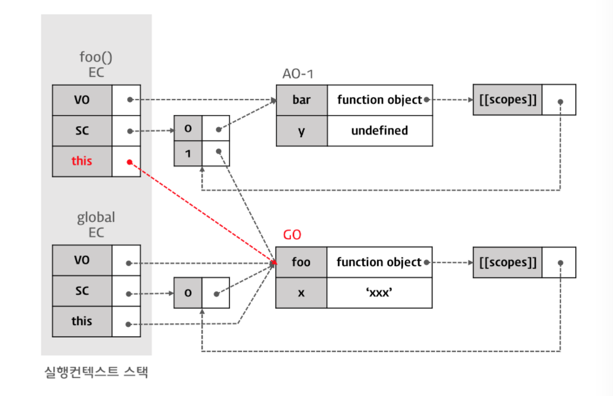
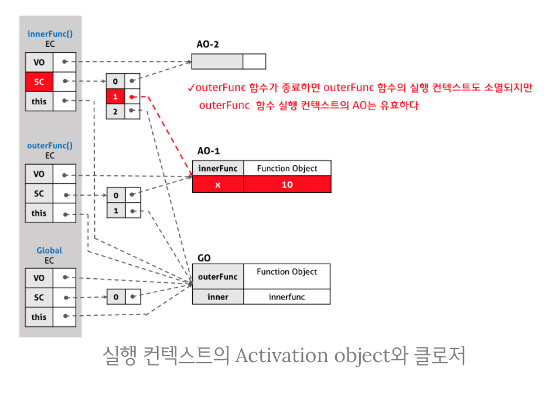

<h1>Day7</h1>

---

<h1>Chapter 1: Execution Context (실행 컨텍스트와 자바스크립트의 동작 원리)</h1>

---

<h2>실행 컨텍스트</h2>

- 실행 가능한 코드를 형상화하고 구분하는 추상적인 개념
    - 실행가능한 코드?
    - 실행 컨텍스트는 실행 가능한 코드가 실행되기 위해 필요한 환경
    - 그 환경을 객체화 해서 관리한다. 
- 실행 컨텍스트를 잘 알고있으면 디버깅이 잘된다.          
- 실행 컨텍스트 (Execution Context)는 scope, hoisting, this, function, closure등의 동작원리를 담고있는 자바스크립트의 핵심원리이다
- 실행 컨텍스트를 바로 이해하지 못하면 코드 독해가 어려워지며 디버깅도 매우 곤란해질것이다
- 실행 가능한 코드:  
    1. 전역 코드: 전역 영영에 존재하는 코드
    2. Eval 코드: Eval 함수로 실행되는 코드
    3. 함수 코드: 함수 내에 존재하는 코드
        - 내가 참조할수있는 모든 상위 변수정보들을 알고있어야된다.
        - this, 함수가 어떻게 호출되었느냐에 따라 결정된다. 
- 실행에 필요한 여러가지 정보들:
    1. 전역변수, 지역변수, 매개변수, 객체의 프로퍼티
    2. 함수 선언
    3. 변수의 유효범위 (Scope)
    4. this
- 코드를 실행하면 실행 컨텍스트 스택(Stack)이 생성하고 소멸된다
- 현재 실행중인 컨텍스트에서 이 컨텍스트와 관련없는 코드가 실행되면 새로운 컨텍스트가 생성된다.
- 이 컨텍스트는 스택에 쌓이게 되고 컨트롤(제어권)이 이동한다       
- 코드가 실행되기 이전에 전역컨텍스트라는 객체를 만들고 스택에 넣고 실행한다  

---

<h2>실행 컨텍스트의 3가지 객체</h2> 

- 실행 컨텍스트는 실행 가능한 코드를 형상화하고 구분하는 추상적인 개념이지만 물리적으로 객체의 형태를 가지며 아래의 3가지 프로퍼티를 소유한다  
    1. Variable Object (VO/변수객체)
        - vars, funtion declarations, arguments(함수 실행컨텍스트에서만)...
        - 변수와 함수 대한 정보를 관리한다
        - 실행 컨텍스트가 생성되면 자바스크립트 엔진은 실행에 필요한 여러정보들을 담을 객체를 생성한다. 이를 Variable Object (VO)라고 한다. Variable Object는 코드가 실행될때 엔진에 의해 참조되며 코드에서는 접근할 수 없다
        - 변수, 매개변수(parameter)와 인수정보(argument), 함수선언 (함수표현식은 제외)를 담고있는 객체이다
        - Variable Object는 실행 컨텍스트의 프로퍼티이기 때문에 값을 갖는데 이 값은 다른 객체를 가리킨다. 그런데 전역 코드 실행시 생성되는 전역 컨텍스트의 경우와 함수를 실행할 때 생성되는 함수 컨텍스트의 경우, 가리키는 객체가 다르다. 이는 전역 코드와 함수의 내용이 다르기 때문이다. 예를 들어 전역 코드에는 매개변수가 없지만 함수에는 매개변수가 있다.
        - 코드가 실행되기전 들어올때 항상 window가 있다. window안에 모든 built-in들이 있기 때문에.
        - 전역변수는 window/global object(GO)의 프로퍼티
    2. Scope Chain (SC)
        - Variable object+all parent scopes
        - 프로퍼티 체인과 같은 방식
        - 현재 scope에서 없으면 상부로 올라가면서 찾는다 
        - SC의 가장 상위는 GO다.
        - SC는 일종의 리스트로서 중첩된 함수의 스코프의 레퍼런스를 차례로 저장하고 있는 개념이다.
        - SC는 해당 전역 또는 함수가 참조할수있는 변수, 함수 선언등의 정보를 담고있는 전역객체GO또는활성객체 AO와 리스트를 가리킨다
        - 현재 실행 컨텍스트의 활성 객체(AO)를 선두로 하여 순차적으로 상위 컨텍스트의 활성 객체(AO)를 가리키며 마지막 리스트는 전역 객체(GO)를 가리킨다.
        - Array또는 유사배열로 만들었을것이다.
        - 전역컨텍스트의 VO는 반드시 GO를 가리킨다
        - 함수 실행컨텍스트의 VO는 AO를 가리킨다
        - 문맥에 따라 VO는 AO일수도있고 GO일수도있다
    3. thisValue         
        - Context object   
        - this프로퍼티에는 this 값이 할당된다
        - this에 할당되는 값은 함수 호출 패턴에 의해 결정된다.

    ---

<h2>실행 컨텍스트의 생성 과정</h2>

- 전역 코드에의 진입
    - 시작하기전에 전역객체(GO)가 만들어진다
    초기상태의 전역객체에는 빌트인 객체(Math, String, Array, 등) DOM, BOM이 설정되어있다
    - 전역객체는 단일 사본이다
    = 코드가 종료되면 전역 객체의 라이플 사이클은 종료한다
    - 코드에 진입하면, 전역 실행 컨텍스트가 생성되고 실행 컨텍스트 스택에 쌓인다
    - 실행컨텍스트를 바탕으로 이하의 처리가 순서대로 실행된다
        1. 스코프 체인의 생성과 초기화
            - 리스트에 참조법을 넣는게 "초기화"
            - 전역은 스코프체인을 한개밖에 없다.
        2. Variable Instantiation(변수 객체화) 실행
            - 변수 객체를 만드는것
            - VO가 가리킬것을 만들거나 GO를 가리키게 한다
            - 변수전에 함수부터 찾는다 
            - [함수/변수 호이스팅] 함수/변수명을 VO의 프로퍼티 이름으로, 그리고 함수안 객체들을 그리고 변수의 경우 undefined가 프로퍼티 값으로 할당된다
            - 이 메카니즘에 의해서 전역 변수와 전역 객체는 window의 프로퍼티다
            - 3.1.2.2
        3. this value 결정
    
- 전역 코드의 실행 
    - 컨텍스트 단위로 객체를 분리해야한다 
    - 변수 x값의 할당
    - 함수 foo의 실행
    - 스코프 체인의 생성과 초기화
    - Variable Instatiation 실행
    - this value 결정
        - 메소드가 소속된 객체를 가리킨다
        - 생성자 함수가 생성할 인스턴스를 가리킨다
        - 그 둘을 제외하면, GO를 가리킨다
- foo함수 코드의 실행
    - 변수 y값의 할당 
    - 함수 bar의 실행
        - bar 실행컨텍스트 만든다
    - bar 함수의 AO를 생성한다
    - 스코프 체인을 생성

---

<h1>Chapter 2: Javascript Closure 클로저</h1>

---

<h2>클로저(closure)의 개념</h2>

- 클로저는 내부함수가 참조하는 외부함수의 지역변수가 외부함수에 의해 내부함수가 반환된 이후에도 life-cycle이 유지되는 것을 의미한다

- 함수가 종료되고 EC에서 소멸되는건, 메모리에서 지워지거는게 아니라 보여지는 EC스택에서 없어지는것이다
- 외부함수가 종료되어도 참조가 있다면 가비지컬렉션에 지워지지않는다

---

<h2>클로저의 활용</h2>

- 많이 사용되면 성능적인 면과 자원적인 면에서 손해를 볼수있기때문에 꼭 쓰여야 할때만 쓴다
- 스코프폭이 좁아야 메모리상에서 빨리 사라진다
- 자유변수- 내부함수가 참조하는 변수
    - 전역에 있지않는한 closure대상
- 전역변수 사용을 피하기 위해 IIF이용

