# Fastcampus 
## Frontend Dev SCHOOL
### Software Engineering(1), Database

---

<h2>Software Engineering</h2>
<h3>Definition</h3>

- Software engineering(SWE) is the application of engineering to the design, development, implementation, testing and maintenance of software in a systemati method --> 소프트웨어의 개발, 운용, 유지보수 등의 생명주기 전반을 체계적이고 서술적이며 정량적으로 다루는 학문

---

<h2>Development vs implementation</h2>

- Development: The process of **analysis, design, coding and testing** software
- Implementation:
	- The installation of a computer system of an information system
	- the use of software on a particular computer system

---

<h2>Trend of Software Engineering</h2>

- Acceleration of DevOps adoption
- Continued wave of everything natively mobile
- Greater demand for increased privacy
- Cloud computing will be a thing of the past
- Integration owith Web and Mobile App

---

<h2>DevOps</h2>

- Used to refer toa  set of practices that emphasizes the collaboration and communicatin of both software developers and other information-technology (IT) professionals while automating the process of software delivery and infrastructure changes. It aims at establishing a culture and environment where building, testing, and releasing software can happen rapidly, frequently, and more reliably

---

<h2>DevOps</h2>

- 기존의 개발과 운영 분리로 인해 발생하는 문제들  
문제발생 -> 비방 -> 상처 -> 원인분석 -> 문제해결
- 좋은 소프트웨어를 위한 필수조건
	- 기획팀과의 원활한 소통으로 요구사항을 충실히 반영
	- 운영팀과의 원할한 소통으로 쇱자 불만과 의견을 반영
- 인건비 감축

---

<h2>DevOps</h2>

- 운영과 개발을 통합하여 커뮤니케이션 리소스를 줄이고, 개발 실패확률을 줄임과 동시에 보다 안정적인 서비스를 운영할 수 있음 
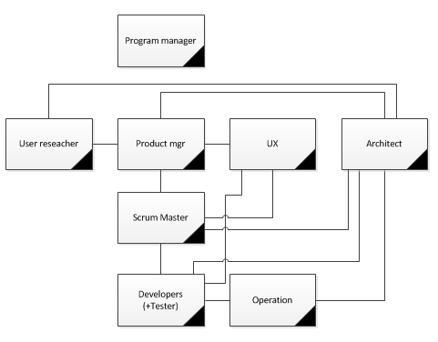

---

<h2>Software Development Life Cycle (개발 생명 주기)</h2>

---

<h2>Requirement Analysis (요구사항 분석)</h2>

---

<h2>Requirements</h2>

>무엇이 현되어야 하는가에 대한 명세
- 시스템이 어떻게 동작해야 하는지 혹은 시스템의 특징이나 속성에 대한 설명 
- 클라이언트가 왜, 뭘, 어떻게  하고싶은지 정확히 파악 

---

<h2>Requirement Analysis</h2>

- 시스템 공학과 소프트웨어 공학 분야에서 수헤자 또는 사용자와 같은 다양한 이해관계자의 상충할 수도있는 요구사항을 고려하여 새로운 제품이나 변경된 제품에 부합하는 요구와 조건을 결정하는 것과 같은 업무

---

<h2>Requirements Analysis</h2>

- 나(개발자)와 클라이언트(사장) 모두를 만족시키기 위한 연결고리

---

<h2>Requirements Analysis</h2>

- 요구사항 유도(수집): 대화를 통해 요구사항을 결정하는 작업
	- 개발할때 막히지 않도록 최대한 많은 정보를 디테일하게 수집해야한다
- 요구사항 분석: 수집한 요구사항을 분석하여 모순되거나 불완전한 사항을 해결하는것
- 요구사항 기록: 요구사항의 문서화 작업

---

<h2>Requirements Layer</h2>

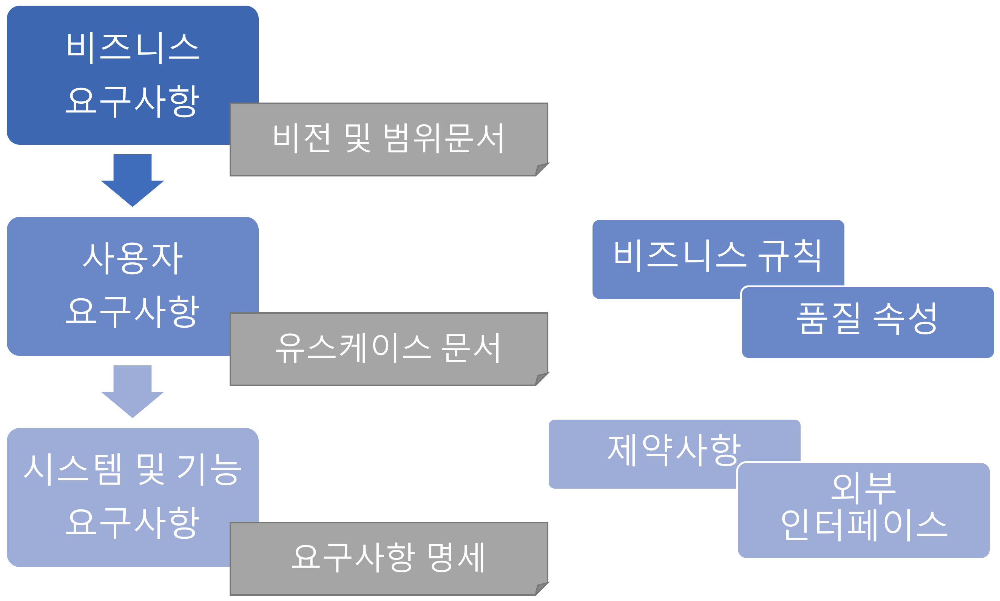

---

<h2>Business Requirements</h2>
>"Why?"

---

<h2>Business Requirements</h2>

>"왜" 프로젝트를 수행하는지
- 고객(제품 사용자, 소유자, 사장, 등)이 제품을 개발함으로써 얻을 수 있는 이득
- Vision and Scope (비전과 범위)

---

<h2>User Requirements</h2>

>"What?"

---

<h2>User Requirements</h2>

>사용자가 이 제품을 통해 할 수 있는 "무엇"
- User cases, Scenarios, User stories, Event-response tables, ..

---

<h2>Use Case Diagram</h2>

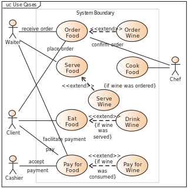

---

<h2>User Scenario</h2>

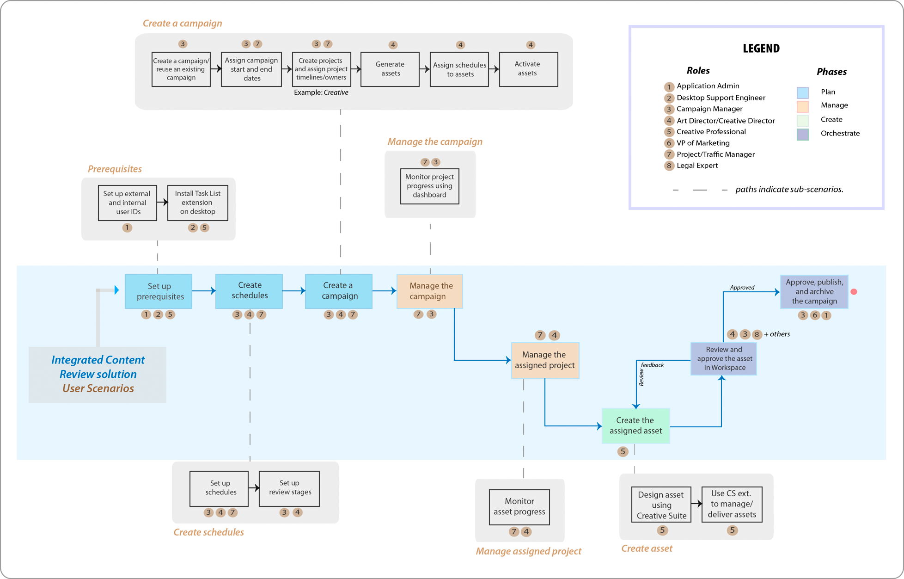

---

<h2>User Stories</h2>

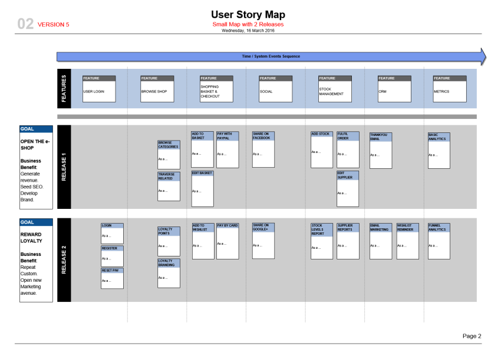
- 가로가 기능
- 세로가 타임라인/단계

---

<h2>Functional Requirements</h2>

>"What?"

---

<h2>Functional Requirements</h2>

>개발자가 이 제품의 "무엇"을 개발할 것인지
- **'~해야한다'**로 끝나 반드시 수행해야 하거나 수용자가 할 수 있어야 하는 것들에 대해 작성
- 강제성을 부여 해야한다
- 디테일하게 작성해야 한다 
- 의문이 발생하면 안된다

---

<h2>System Requirements</h2>

- 여러개의 서브 시스템으로 구성되는 제품에 대한 최상위 요구사항을 설명
- 컴퓨터: 모니터 + 키보드 + 마우스 + 본체 + 스피커

---

<h2>Business Rules</h2>

- 비즈니스 스트럭쳐의 요구나 제약사항을 명세
- "유지 로그인을 위해서는 페이스북 계정이 있어야 한다"
- "유저 프로필 페이지에 접근하기 위해서는 로그인되어 있어야 한다"
- 중요**

---

<h2>Quality Attribute</h2>

- 소프트웨어의 품질에 대해 명세
- "결제과정에서 100명의 사용자가 평균 1.5초의 지연시간 안에 요청을 처리해야 한다"

---

<h2>External Interface</h2>

- 시스템과 외부를 연결하는 인터페이스
- 다른 소프트웨어, 하드웨어, 통신 인터페이스, 프로토콜...

---

<h2>Constraint</h2>

- 기술, 표준, 업무, 법, 제도 등의 제약조건 명세
- 개발자들의 선택사항에 제한을 두는 것
- ex. 크롤링 하는 서비스들 -> 지적 제상권 위반

---

<h2>When the well is full, it will run over.</h2>

---

<h2>지나치게 자세한 명세작성</h2>

- 명세서는 말 그대로 명세일 뿐, 실제 개발 단계에서 마주칠 모든 것을 담을 수 없음
- 개발을 언어로 모두 표현할 수 없음
- 명세서가 완벽하다고 해서 상품도 완벽하리란 보장은 없음
- 때로는 명세를 작성하기 보단 프로ㅗ타이핑이 더 간단할 수 있음

---

<h2>Software Development Lifecycle Process Model</h2>

---

<h2>Build-fix Model</h2>

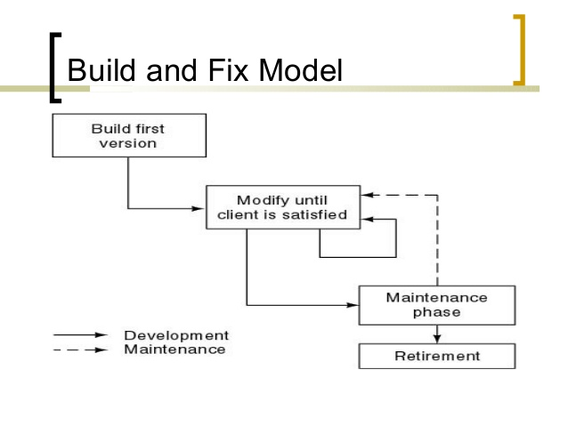

---

<h2>Build-fix Model</h2>

- 설계없이 일단 개발, 만족할 때까지 수정
- 시작이 빠름
- 계획이 정확하지 않음, 개발 문서가 없고 진행상황 파악이 힘듦

---

<h2>Waterfall Model</h2>

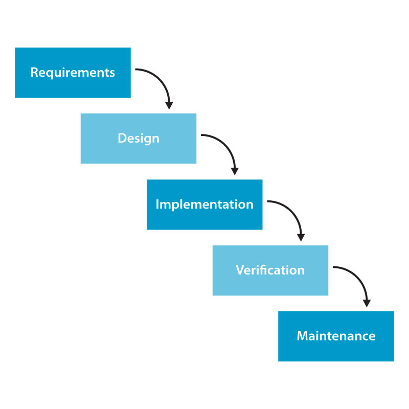

---

<h2>Waterfall Model</h2>

- 순차적인 개발 모델, 가장 많이 사용함
- 정형화된 접근 가능, 체계적인 문서화 가능
- 직전단계가 완료되어야 진행 가능 

---

<h2>Prototype Model</h2>

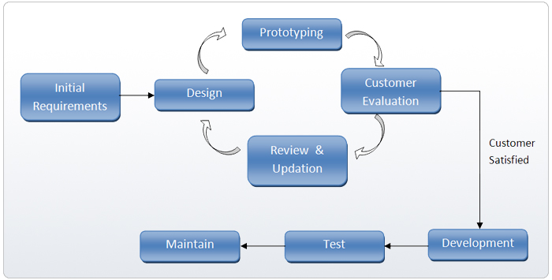

---

<h2>Prototype Model</h2>

- 고객 요구사항을 적극적으로 반영하는 모델
- 빠른 개발과 고객 피드백을 빠르게 반영할 수 있음
- 대규모 프로젝트에 적응하기 힘듦

---

<h2>Spiral Model</h2>

---

<h2>Spiral Model</h2>

- 대규모 or 고비용 프로젝트
- 프로젝트의 위험요인을 제거해 나갈 수 있음
- 각 단계가 명확하지 않음

---

<h2>이외에도...</h2>

- RAD (Rapid Application Development) Model
- Iterative Development Model
- V Model
- Component Based Development

---

<h2>Software Development Process </h2>

- in Agile
	- Agility
	- 

<h2>UP (Unified Process)</h2>

- 도입 (분석위주), 상세 (설계위주), 구축 (구현위주), 이행 (최종 릴리즈)의 반복

<h2>XP(eXtreme Process)</h2>

- 스크럼 마스터가 주도적으로 프로세스를 주도하며, 고객과 개발자 사이의 소통을 중시함
- Product Owner와 Development Team, Customer로 롤을 구분하고 각자의 역할에 충식
- TDD 중시

---

<h2>TDD</h2>
<h3>Test Driven Development</h3>

- 객체지향적
- 재설계 시간 단축
- 디버깅 시간 단축
- 애자일과의 시너지 (사용자 중심적)
- 테스트 문서 대체
- 추가 구현 용이  

- 테스트코드를 먼저 짜야한다**

---

<h2>Database</h2>
<h3>data</h3>

- 컴퓨터가 처리할 수 있는 문자, 숫자, 소리, 그림 따위의 형태로 된 정보
- Latin "Datum"의 복수형 "Data"에서 유래

---

<h2>Database</h2>

- 체계화된 데이터의 모임
- 여러 응용 시스템들의 통합된 정보들을 저장하여 운영할 수 있는 공용 데이터들의 묶음

---

<h2>DB? DBMS?</h2>

DBMS(DataBase Management System)
- 데이터의 모임인 Database를 만들고, 저장, 관리 할 수 있는 기능을 제공하는 응용프로그램
- Oracle, Mysql, MariaDB, DB2, MS SQL, Server, ..

---

<h2>DBMS의 조상님</h2>

---

dBase
- 마이크로컴퓨터용 최초의 DBMS
- 1979년 Ashton이 개발
- SQL이 아닌 독자 스크립터 언어로 실행 -> dbf파일 생성

---

<h2>Characteristics</h2>

- 데이터의 무결성
- 데이터의 중복 방지
- 보안 (추상화, 접근권한)
- 성능 향상
- 프로그램 수정과 유지 보수 용이

---

<h2>Differences between DataBase & File System</h2>

자기 기술성  
File System

- .hwp -> 한글
- .doc -> Microsoft Word
- .xls -> Microsoft Excel

DB

- Only SQL (RDBMS)

---

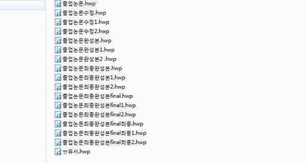

---

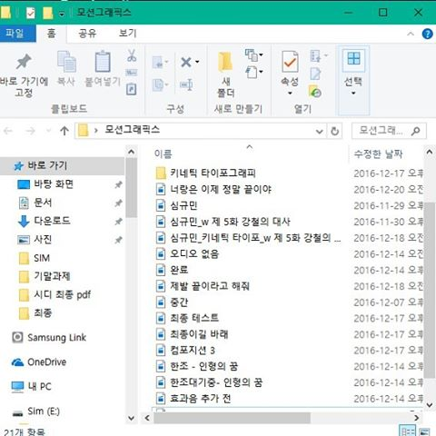

---

<h2>SQL(Structured Query Language)</h2>

데이터 관리를 위해 설계된 특수 목적의 프로그래밍 언어   

---

<h2>SQL- 데이터 정의언어</h2>

<h3>데이터를 정의</h3>  
CREATE- DB 개체 정의   
DROP- DB 개체 삭제   
ALTER- DB개체 정의 변경

---

<h2>SQL- 데이터 조작언어</h2>

<h3>데이터 검색, 등록, 삭제, 갱신</h3>

INSERT - 행, 테이블 데이터 삽입   
UPDATE - 테이블 업데이트   
DELETE - 특정 행 삭제   
SELECT - 테이블 검색 결과 집합

---

<h2>데이터 제어 언어</h2>

<h3>데이터 엑세스 제어</h3>

GRANT - 작업 수행권한 부여   
REVOKE - 권한 박탈

---

<h2>RDBMS vs NoSQL</h2>

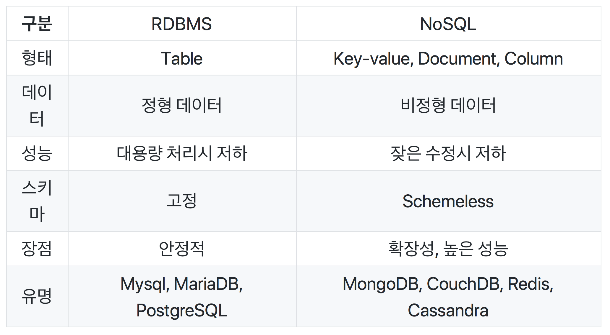

---

<h2>RDBMS</h2>

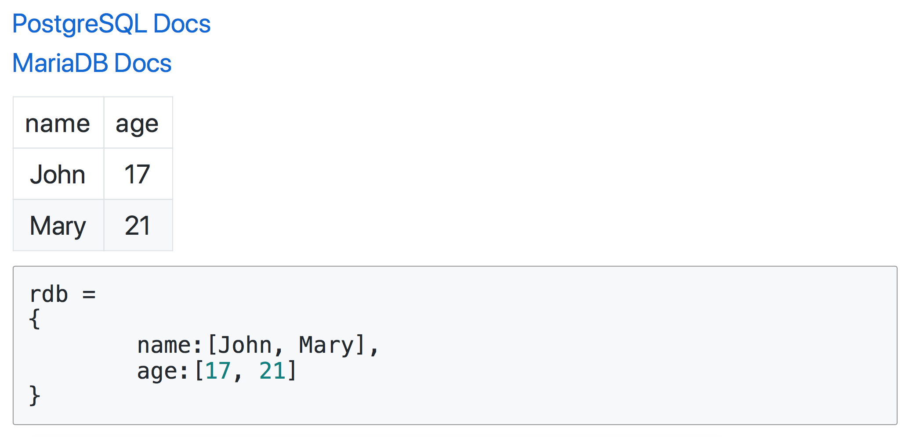

---

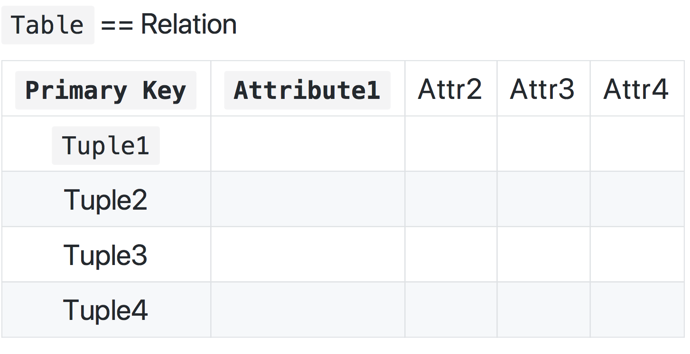

---

<h2>NoSQL</h2>

---

<h2>Document vs Key-value</h2>

---

<h2>How to Design Database?</h2>

---

<h2>Schema</h2>

- Database의 구조와 제약조건에 대한 전반적인 명세 기술
- Database의 Blueprint
- 외부(서브)스키마, 개념스키마, 내부스키마로 구성

---

<h2>외부(서브) 스키마</h2>

- 프로그램 사용자가 필요로 하는 데이터베이스의 논리적인 구조를 정의

---

<h2>개념 스키마</h2>

- 조직 전체의 관점에서의 구조의 관게를 정의
- 외부 스키마의 합과 그 사이의 데이터의 관계 등등
- 일반적인 스키마의 정의

---

<h2>내부 스키마</h2>

- 저장장치의 입장에서 데이터베이스가 저장되는 방법을 기술

---

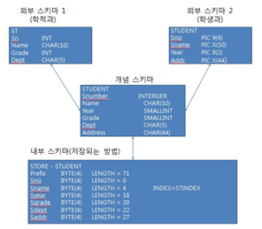

---

<h2>Design Database</h2>

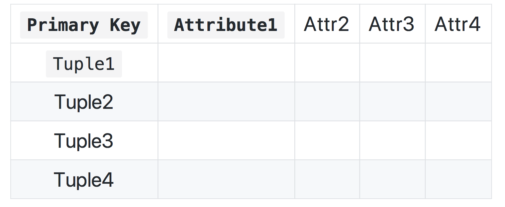

---

<h2>SQLite</h2>

---

<h2>SQLite with python</h2>

---

<h2>SQLite - check sqlite version</h2>

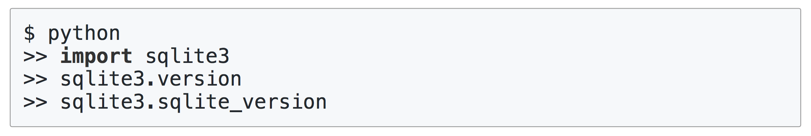

---

<h2>SQLite - Create table</h2>

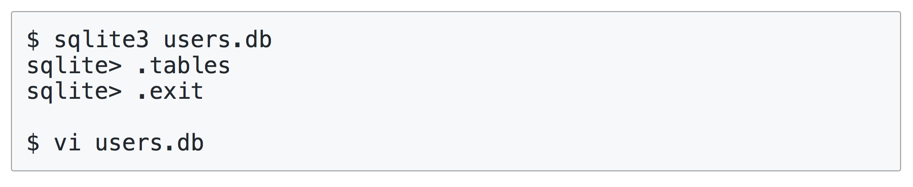

---

<h2>SQLite ‐ Create table & Insert User</h2>

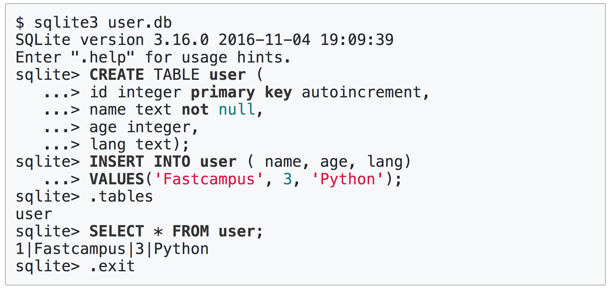

---

<h2>SQLite - insert data</h2>

- sqlite3.connect 메소드를 이용해서 DB 파일에 연결한 후 'Connection' 객체를 생성한다.
- Connection객체를 통해 Cursor 객체를 생성한다.
- 'Cursor' 객체의 execute 메소드를 통해서 query를 실행한다
- 'Connection' 객체의 commit를 이용하여 변경된 내용을 commit한다.
- DB와의 연결을 닫는다

---